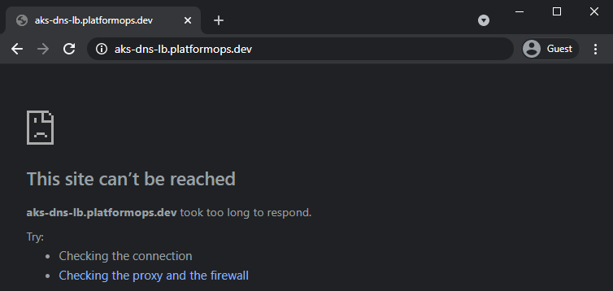
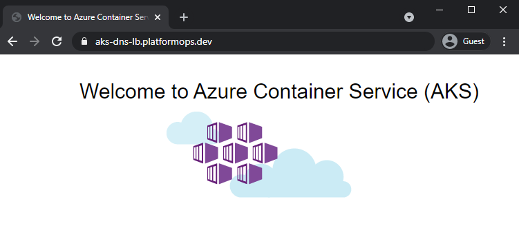

## AKS DNS Load Balancer

### Custom Domain (DNS) Forwarding to Kubernetes (AKS) Cluster via Load Balancer in Azure

In this tutorial we'll deploy Kubernetes AKS cluster in Azure, set up Vnet Network, provision Let's Encrypt SSL Certificate and Azure Load Balancer to securely route traffic from the External (Internet) to Internal application (AKS Cluster).

### Resources Deployed

The following resources will be provisioned in GCP at the end of this tutorial.

|Name|Details|
|-----|-----|
|Azure Kubernetes Service (AKS)|[Azure Docs](https://docs.microsoft.com/en-us/azure/aks/intro-kubernetes)|
|Azure Load Balancer|[Azure Docs](https://docs.microsoft.com/en-us/azure/load-balancer/load-balancer-overview)|
|Azure Vnet & Subnet|[Azure Docs](https://docs.microsoft.com/en-us/azure/virtual-network/virtual-networks-overview)|
|Public IP Address|[Azure Docs](https://docs.microsoft.com/en-us/azure/virtual-network/public-ip-addresses)|
|Let's Encrypt SSL Certificate|[Let's Encrypt Docs](https://letsencrypt.org/)|

### Prerequisites

You'll need these prerequisite items in order to run this tutorial.

|Name|Description|
|-----|-----|
|[Azure Subscription](https://azure.microsoft.com/en-gb/free/)|Your own Azure subscription - Free Trial available!|
|[Microsoft Powershell](https://docs.microsoft.com/en-us/powershell/scripting/overview)|We'll run all the commands in this tutorial using Powershell|
|[Azure CLI](https://docs.microsoft.com/en-gb/cli/azure/)|To interact with Azure resources from Powershell|
|[Kubernetes CLI](https://chocolatey.org/packages/kubernetes-cli)|To interact with Kubernetes cluster from Powershell|
|[Helm CLI](https://chocolatey.org/packages/kubernetes-helm)|To interact with Kubernetes Helm deployments from Powershell|
|[Domain Name](https://en.wikipedia.org/wiki/Domain_name)|Your own Domain Name - in this tutorial I'm using my own *platformops.dev*|

### Tutorial Contents

|Name|Description|
|-----|-----|
|[aks-dns-lb.ps1](aks-dns-lb.ps1)|Powershell to run this tutorial|
|[yaml/deploy.yaml](yaml/deploy.yaml)|Deployment [YAML Template](https://kubernetes.io/docs/concepts/workloads/controllers/deployment/) for Kubernetes Application|

### Assumptions

It is assumed that beyond this point of this tutorial:
- You have *Azure Subscription* provisioned
- You have relevant *Roles and Privileges* setup for your User or Service Account
- You are *Logged-in* to your Subscription via *Azure CLI*

## Verify Pre-deployment DNS Access

Just to make sure your chosen DNS entry, in our case *aks-dns-lb.platformops.dev*, forward rule is not working.

Let's request *aks-dns-lb.platformops.dev* and the result should be the typical *This site can't be reached* error.



### Expected Result

At the end of this tutorial, your chosen DNS entry, in our case *aks-dns-lb.platformops.dev*, will return this.



## Setup Variables

Create variables to run in our tutorial - we'll reference these at various stages during this tutorial.

### Azure Subscription ID

This is required – it is your [Azure Subscription](https://azure.microsoft.com/en-gb/free/) ID.

```powershell
$subscription = "<AZURE SUBSCRIPTION ID or NAME>"
```

### Remaining Variables

These can be left unchanged with defaults as below or rename these to suit your naming conventions, network requirements or cluster specifics.

```powershell
$aksName = "aks-dns-lb-c1"
$resourceGroupName = "aks-dns-lb"
$location = "westeurope"
$nodeVMSize = "Standard_B2s"
$nodeCount = "1"
$kubernetesVersion = "1.19.7"
$maxPods = "110"
$diskSize = "32"
```

## Deploy Azure Resources

We'll first provision all we need in Azure from the Azure resources point of view.

### Set Subscription

```powershell
az account set --subscription $subscription
```

### Create Resource Group

```powershell
az group create `
--subscription $subscription `
--name $resourceGroupName `
--location $location
```

### Deploy AKS

```powershell
az aks create `
--name $aksName `
--subscription $subscription `
--resource-group $resourceGroupName `
--location $location `
--node-vm-size $nodeVMSize `
--node-count $nodeCount `
--kubernetes-version $kubernetesVersion `
--max-pods $maxPods `
--node-osdisk-size $diskSize `
--generate-ssh-keys
```

> Wait for the above to finish before moving to the next step - this might take 10-20 minutes to provision in Azure.

## Access AKS

### Get Context

```powershell
az aks get-credentials `
--resource-group $resourceGroupName `
--name $aksName
```

### Check Context

```powershell
kubectl config get-contexts
kubectl config current-context
```

### Create Namespace

```powershell
kubectl create namespace aks-dns-lb
```

## Configure DNS

Once we know our public IP Address we can configure it to forward calls to your domain and then all the way to our AKS in Azure.

### Deploy Ingress Controller

```powershell
helm repo add ingress-nginx https://kubernetes.github.io/ingress-nginx
helm repo update
helm install nginx-ingress ingress-nginx/ingress-nginx `
--namespace aks-dns-lb `
--set controller.replicaCount=2 `
--set controller.nodeSelector."beta\.kubernetes\.io/os"=linux `
--set defaultBackend.nodeSelector."beta\.kubernetes\.io/os"=linux `
--set controller.admissionWebhooks.patch.nodeSelector."beta\.kubernetes\.io/os"=linux
```

### Acquire Public IP Address

Let's grab our public IP address with this command.

```powershell
Write-Host "Your IP Address =>" `
(kubectl get svc nginx-ingress-ingress-nginx-controller `
-n aks-dns-lb -o jsonpath='{.status.loadBalancer.ingress[0].ip}')
```

### Create "A" Record with Custom DNS

If you have your NS ([Nameserver](https://en.wikipedia.org/wiki/Name_server)) Records configured with your own DNS registrar with whom you've registered your domain then you'll need to do the following.

- Login to your Domain Registrar portal
- Go to DNS settings for your Domain
- Add *A* record, in our case *aks-dns-lb*, pointing to the Public IP Address obtained earlier


> Note: DNS changes can take 10-20 minutes to propagate.

## Configure SSL

## Deploy Certificate Manager

```powershell
kubectl label namespace aks-dns-lb cert-manager.io/disable-validation=true
helm repo add jetstack https://charts.jetstack.io
helm repo update
helm install cert-manager jetstack/cert-manager `
--namespace aks-dns-lb `
--set installCRDs=true `
--set nodeSelector."kubernetes\.io/os"=linux `
--set webhook.nodeSelector."kubernetes\.io/os"=linux `
--set cainjector.nodeSelector."kubernetes\.io/os"=linux
```

## Deploy Applications in AKS

Great, so we have AKS cluster in Azure as well as the networking infrastructure, public IP address, SSL certificate and DNS up and running now. Let's now move down to the app deployments into [Kubernetes](https://kubernetes.io/).

### Deploy Sample AKS Application

We'll use this YAML Template [yaml/deploy.yaml](yaml/deploy.yaml) to setup Certificate Issuer, Deployment, Service, Pod and Ingress.

Let's run the App deployment into our AKS cluster.

```powershell
kubectl apply -f yaml/deploy.yaml
```

### Check Deployments

Keep checking output from this command - at some stage you'll see 1x Pod Running, 1x Ingress, 1x Service and 1x SSL Certificate Provisioned for our app.

```powershell
kubectl get all -n aks-dns-lb
kubectl get ingress -n aks-dns-lb
kubectl get certificate -n aks-dns-lb
```

> Wait for the above to finish before moving to the next step - the SSL Certificate can stay in *Provisioning* state for up to 60 minutes before it becomes *Active*.

## Test our Application

Simply request your chosen Domain, in our case that is *aks-dns-lb.platformops.dev*, and verify that it now resolves to our sample AKS application running in Kubernetes in Azure.

> If we didn't have SSL Certificate configured as per steps above our sample AKS website would not respond because the latest browsers enforce [HTTP Strict Transport Security (HSTS)](https://en.wikipedia.org/wiki/HTTP_Strict_Transport_Security).

> Notice *SSL Certificate Padlock* now securing our app according to the HSTS standards.


## Clean-up

Simply run these commands below and within 5-10 minutes your Kubernetes and Azure Resources will be all gone.

### Delete Azure Infrastructure

This deletes all Azure resources which we've provisioned for this tutorial.

```powershell
az group delete `
--subscription $subscription `
--name $resourceGroupName `
--yes
```

### Clear AKS Access Details

This deletes your AKS cluster context and access details to the cluster form your workstation.

```powershell
kubectl config delete-context $aksName
kubectl config unset users.clusterUser_"$resourceGroupName"_"$aksName"
kubectl config unset contexts.$aksName
kubectl config unset clusters.$aksName
```

### Delete A Record in DNS

And of course, don't forget to delete the *A Record* we've created earlier in the DNS Setup stage. Simply go to your DNS management portal and delete the *A Record*.